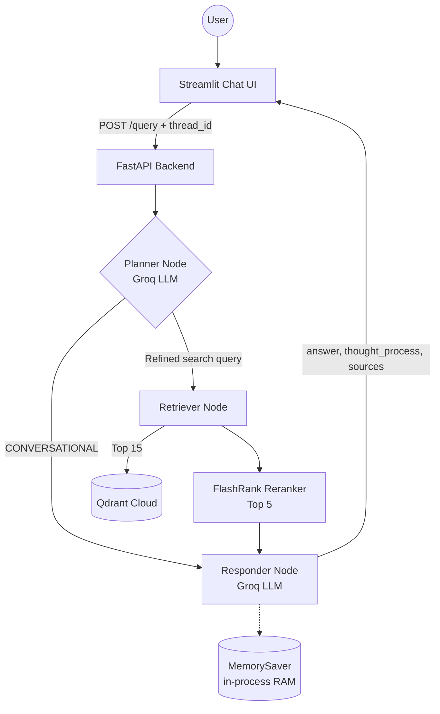
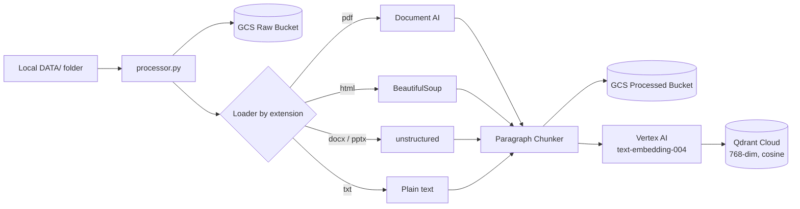
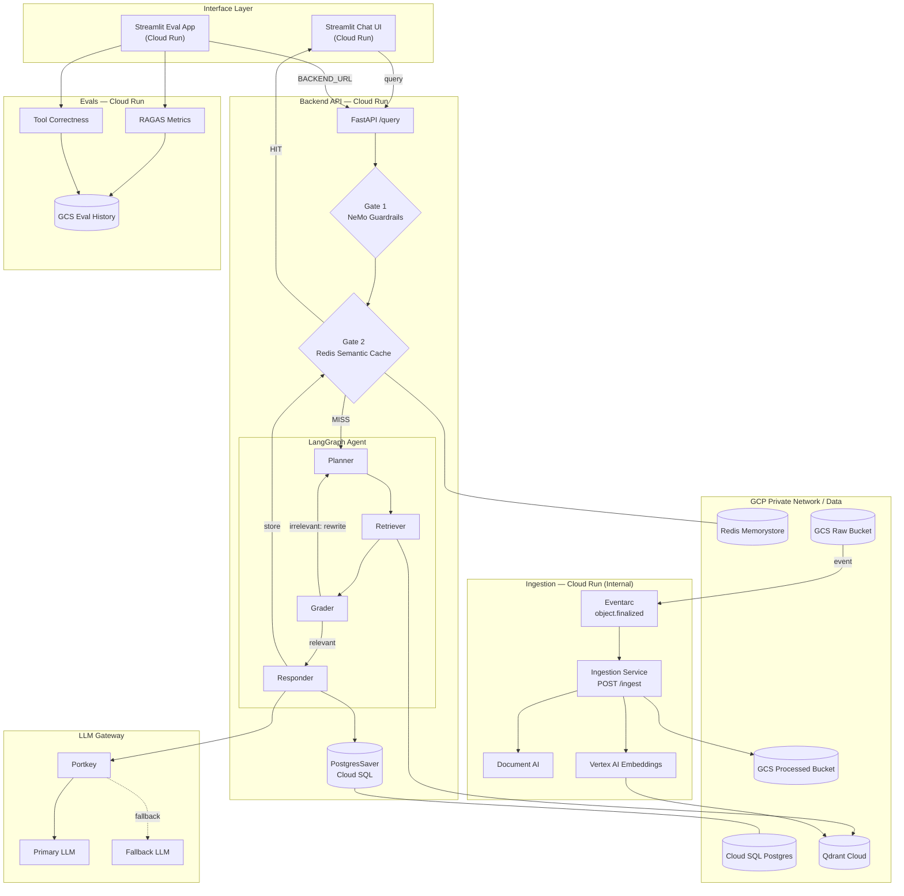

# Enterprise Agentic RAG

An agentic Retrieval-Augmented Generation (RAG) system built with **LangGraph**, **Groq**, **Qdrant**, and **Google Cloud Platform**. A planner agent decides whether a question needs document retrieval or can be answered from conversation memory. Retrieved context is reranked locally with FlashRank before the answer is generated.

| Version | Status | Summary |
|---------|--------|---------|
| **v1** | ✅ Current | Single-process app: LangGraph agent, FastAPI backend, Streamlit UI, CLI-driven ingestion, in-memory conversation memory |
| **v2** | 🗺️ Future scope | Microservices on Cloud Run, guardrails, semantic cache, persistent memory, event-driven ingestion, evals, Terraform |

---

## v1 — Current State

### Features

- **Agentic routing.** A LangGraph `StateGraph` runs **Planner → (Retriever) → Responder**. The planner reads the full conversation and either marks the message as `CONVERSATIONAL` (so retrieval is skipped) or rewrites it into a refined search query.
- **Conversation memory.** LangGraph `MemorySaver` keys memory by `thread_id`. Each Streamlit session gets its own UUID thread. Memory lives in process RAM and is lost when the backend restarts.
- **Two-stage retrieval.** Qdrant returns the top 15 candidates by vector similarity. FlashRank, a local ONNX cross-encoder, reranks them and keeps the top 5.
- **LLM inference on Groq.** The model is set by `GROQ_MODEL` (default `qwen/qwen3.8-27b`). Context sent to the LLM is capped at about 25k characters to stay under Groq's tokens-per-minute (TPM) limits.
- **Multi-format ingestion:**
  - **PDF:** Google Document AI OCR. PDFs longer than 15 pages are split to fit synchronous API limits, and PDFs protected only by an owner password are opened automatically.
  - **HTML:** BeautifulSoup, with scripts and styles stripped.
  - **DOCX / PPTX:** `unstructured`.
  - **TXT:** read as plain text.
- **Robust chunking.** Text is chunked by paragraph (1,500 characters). Paragraphs that are too long fall back to word-level splitting, which handles Document AI returning a whole page as one block.
- **Idempotent indexing.** Point IDs are deterministic UUIDv5 values built from `source_type/filename#chunk`, so re-ingesting a file overwrites its vectors instead of duplicating them.
- **GCS archival.** Raw files go to a raw bucket. Chunked JSON goes to a processed bucket.
- **Observability.** Pydantic Logfire spans cover the UI, API, every agent node and ingestion. LangSmith traces LangChain and LangGraph calls.

### Architecture



**Ingestion (CLI, run manually):**



### API

| Method | Path | Description |
|--------|------|-------------|
| `GET` | `/` | Health check |
| `GET` | `/graph` | PNG render of the LangGraph workflow |
| `POST` | `/query` | Run the agent. Body: `{"q": "...", "thread_id": "..."}`. Returns `question`, `answer`, `thought_process`, `status`, `sources` |

### Project Structure

```text
├── app/
│   ├── main.py                     # FastAPI entrypoint (/, /graph, /query)
│   ├── config.py                   # Centralized env var settings + LangSmith env wiring
│   ├── agents/
│   │   ├── graph.py                # StateGraph, conditional routing, MemorySaver
│   │   ├── state.py                # Agent state schema
│   │   └── nodes/
│   │       ├── planner.py          # Intent classification / query rewriting
│   │       ├── retriever.py        # Qdrant search + FlashRank rerank
│   │       ├── responder.py        # Answer synthesis (RAG or conversational)
│   │       └── grader.py           # (v2 — placeholder) document relevance grader
│   ├── ingestion/
│   │   ├── processor.py            # CLI bulk ingestion: parse → chunk → embed → index
│   │   ├── chunking/
│   │   │   └── splitter.py         # Paragraph chunker with long-paragraph fallback
│   │   └── loaders/
│   │       ├── pdf.py              # Google Document AI (auto-splits >15 pages)
│   │       ├── html.py             # BeautifulSoup
│   │       ├── office.py           # DOCX / PPTX via unstructured
│   │       ├── text.py             # Plain text
│   │       ├── csv.py              # (v2 — placeholder)
│   │       └── excel.py            # (v2 — placeholder)
│   └── services/
│       └── retrieval/
│           ├── embedding.py        # Vertex AI text-embedding-004 (lazy, batched)
│           ├── qdrant_service.py   # Vector search
│           └── ranking_service.py  # FlashRank reranker (lazy-loaded)
├── ui/
│   └── app.py                      # Streamlit chat UI (sessions, reasoning steps, sources)
├── DATA/
│   ├── true_data/                  # Relevant docs (Kubernetes jobs, cronjobs, autoscaling…)
│   └── noisy_data/                 # Distractor corpus to test retrieval precision
├── requirements.txt
└── pyproject.toml
```

### Tech Stack

| Layer | Technology |
|-------|-----------|
| Agent Orchestration | LangGraph |
| LLM | Groq (`GROQ_MODEL`, default `qwen/qwen3.8-27b`) via `langchain-groq` |
| Memory | LangGraph `MemorySaver` (in-process) |
| Vector DB | Qdrant Cloud |
| Embeddings | Vertex AI `text-embedding-004` (768-dim) |
| Reranking | FlashRank (local ONNX cross-encoder) |
| Document Parsing | Google Document AI (PDF), BeautifulSoup (HTML), unstructured (DOCX/PPTX) |
| Storage | Google Cloud Storage (raw + processed buckets) |
| Backend | FastAPI + Uvicorn |
| Frontend | Streamlit |
| Observability | Pydantic Logfire + LangSmith |

### Getting Started

#### Prerequisites

- Python 3.12
- A GCP project with Document AI (an OCR processor), Vertex AI, and two GCS buckets
- A Qdrant Cloud cluster
- API keys for Groq, Logfire, and LangSmith (optional)

#### Setup

```bash
python -m venv .venv
source .venv/bin/activate
pip install -r requirements.txt

# Authenticate to GCP (used by Document AI, Vertex AI, GCS)
gcloud auth application-default login
```

Create a `.env` file in the project root:

```env
# LLM
GROQ_API_KEY=
GROQ_MODEL=qwen/qwen3.8-27b

# Qdrant
QDRANT_CLUSTER_ENDPOINT=
QDRANT_API_KEY=

# Observability
LOGFIRE_TOKEN=
LANGSMITH_TRACING=true
LANGSMITH_ENDPOINT=
LANGSMITH_API_KEY=
LANGSMITH_PROJECT=enterprise-rag-1

# Google Cloud
PROJECT_ID=
LOCATION=us-central1
GCP_DOC_AI_LOCATION=us
GCP_DOC_AI_PROCESSOR_ID=
GCP_RAW_BUCKET=
GCP_PROCESSED_BUCKET=

# UI
BACKEND_URL=http://localhost:8000
```

#### Ingest documents

```bash
# Ingest everything under DATA/ (subfolders map to source_type: true / noisy / <folder name>)
python -m app.ingestion.processor DATA

# Ingest a single folder
python -m app.ingestion.processor DATA/true_data

# Drop and recreate the Qdrant collection first
python -m app.ingestion.processor DATA/true_data --wipe
```

The script exits with code `1` if any file fails. Failed files are logged and skipped, and the rest of the batch keeps going.

#### Run

```bash
# Terminal 1 — backend
uvicorn app.main:app --reload --port 8000

# Terminal 2 — UI
streamlit run ui/app.py
```

### Known Limitations (addressed in v2)

- Memory is in process RAM, so conversations are lost on restart and can't be shared across replicas.
- Ingestion is manual. New documents need a CLI run.
- There are no input guardrails, so jailbreak and off-topic prompts reach the LLM.
- There is no response caching, so repeated questions always hit the LLM.
- There is a single LLM provider with no fallback.
- There is no automated evaluation of retrieval or answer quality.
- There is no containerization or IaC. The app runs locally as one process.

---

## v2 — Future Scope

v2 turns the monolith into a scalable, production-grade platform: independent Cloud Run services, event-driven ingestion, persistent memory, safety and caching gates, and an evaluation suite. All of it is managed with Terraform.

### Planned Features

| Area | Plan |
|------|------|
| **Self-correcting retrieval** | A **Grader node** scores retrieved chunks for relevance. If context is weak, it rewrites the query and retrieves again (a corrective RAG loop) |
| **More loaders** | **CSV** and **Excel** loaders for tabular data |
| **Gate 1: Guardrails** | NeMo Guardrails blocks jailbreak and off-topic prompts before they reach the agent |
| **Gate 2: Semantic cache** | Redis Memorystore with Vertex AI embeddings. Serves cached answers to semantically similar questions by cosine distance |
| **Persistent memory** | LangGraph `PostgresSaver` on Cloud SQL Postgres, so conversations survive restarts and scale-to-zero |
| **LLM gateway** | Portkey routes LLM calls with automatic fallback to a smaller model and adds a usage and cost dashboard |
| **Event-driven ingestion** | Uploading to the GCS raw bucket triggers Eventarc, which calls an internal ingestion service at `POST /ingest`. No manual steps |
| **Evaluation suite** | RAGAS metrics (faithfulness, answer relevancy, context precision/recall, etc.), tool-correctness scoring, a guardrails TP/FP/TN/FN report, a golden dataset, and eval history stored in GCS, all shown in a Streamlit eval dashboard |
| **Microservices** | Four Cloud Run services: Backend, Chat UI, Ingestion (internal), Evals. Each has its own Dockerfile and requirements |
| **Infrastructure as Code** | Terraform for VPC, GCS, Redis, Cloud SQL, Eventarc, Cloud Run and IAM |
| **CI/CD** | Cloud Build pipeline that builds all service images in parallel |
| **Networking** | Direct VPC egress to reach Redis and Cloud SQL over private IP |
| **Citations** | Return source filename and GCS path with each retrieved chunk in the UI |

### Target Architecture



### Roadmap

1. **Agent quality.** Grader node with a corrective retrieval loop, CSV/Excel loaders, and source citations.
2. **Persistent memory.** Swap `MemorySaver` for `PostgresSaver` on Cloud SQL.
3. **Safety and cost.** NeMo Guardrails (Gate 1), Redis semantic cache (Gate 2), and the Portkey gateway with fallback.
4. **Event-driven ingestion.** Split ingestion into its own service triggered by Eventarc.
5. **Evaluation.** Golden dataset, RAGAS and guardrails evals, and a Streamlit eval dashboard.
6. **Productionize.** Dockerfiles per service, Terraform IaC, and a Cloud Build CI/CD pipeline.
