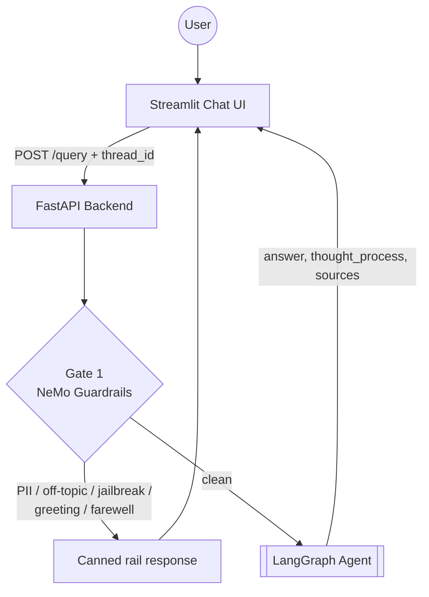
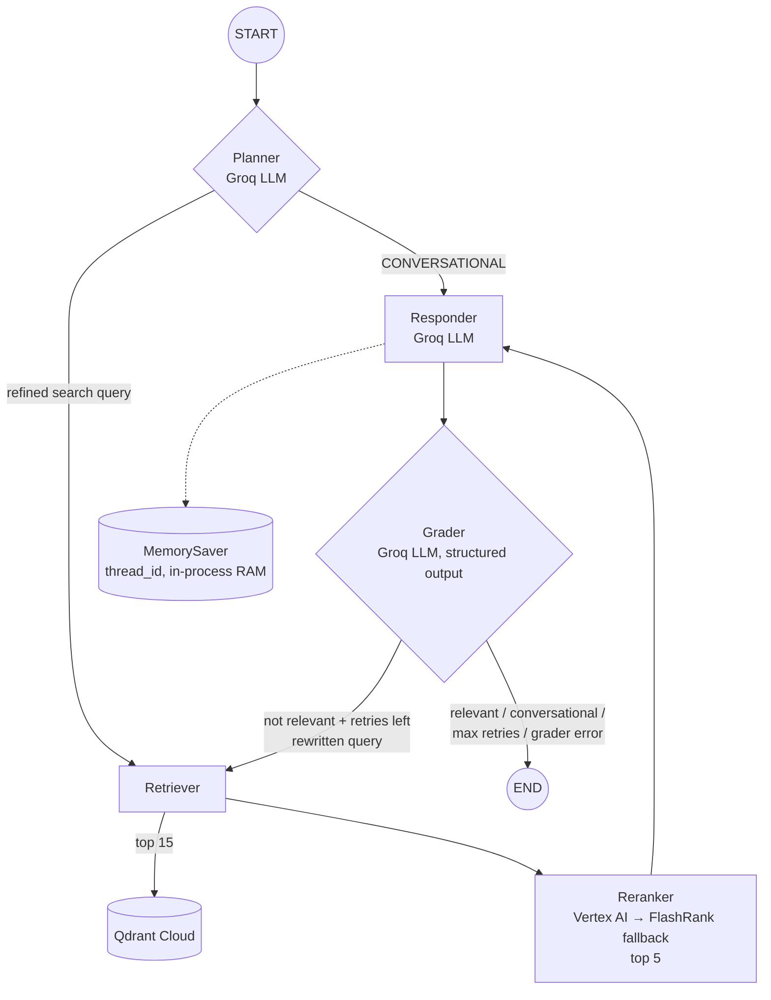
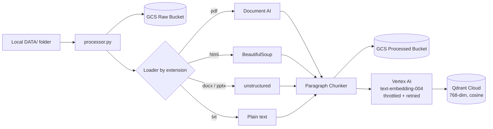
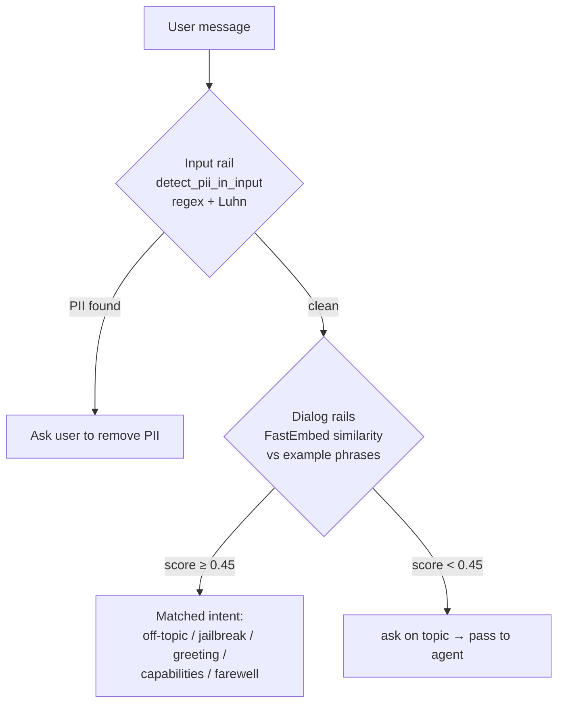
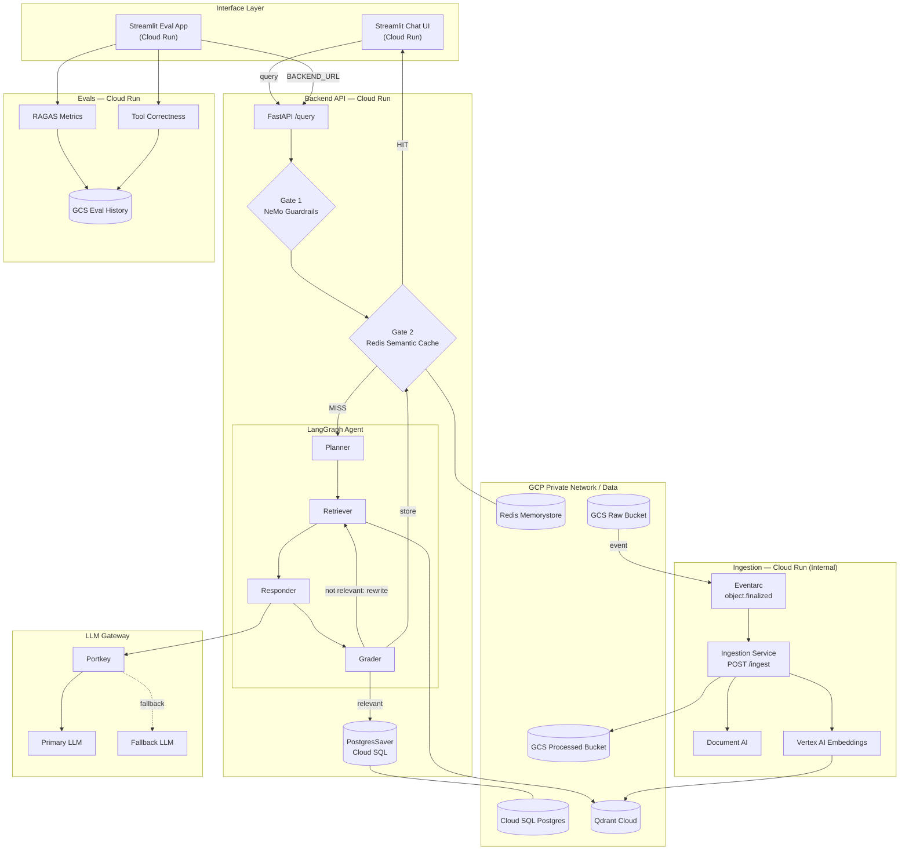

# Enterprise Agentic RAG

An agentic Retrieval-Augmented Generation (RAG) system built with **LangGraph**, **Groq**, **Qdrant**, and **Google Cloud Platform**. Every request first passes a **NeMo Guardrails** gate that blocks PII, jailbreaks, and off-topic prompts. A planner agent then decides whether the question needs document retrieval or can be answered from conversation memory. Retrieved context is reranked before the answer is generated, and a grader node checks the answer and retries retrieval with a rewritten query if it falls short.

| Version | Status | Summary |
|---------|--------|---------|
| **v1** | ✅ Current | Single-process app: guardrails gate, self-correcting LangGraph agent, FastAPI backend, Streamlit UI, CLI-driven ingestion, in-memory conversation memory, Dockerfile for the API |
| **v2** | 🗺️ Future scope | Microservices on Cloud Run, semantic cache, persistent memory, event-driven ingestion, evals, Terraform |

---

## v1 — Current State

### Features

- **Guardrails gate.** NeMo Guardrails screens every message before the agent runs. It makes no LLM calls (see [Guardrails](#guardrails)):
  - **PII input rail.** Regex checks for emails, phone numbers, SSNs, API keys, and credit card numbers (13–19 digits, Luhn-validated). Messages that match are refused.
  - **Dialog rails.** Off-topic, jailbreak, greeting, capabilities, and farewell intents get canned replies. Intents are matched by embedding similarity against example phrases, using a local FastEmbed model.
- **Agentic routing.** A LangGraph `StateGraph` runs **Planner → (Retriever) → Responder → Grader**. The planner reads the full conversation and either marks the message as `CONVERSATIONAL` (so retrieval is skipped) or rewrites it into a refined search query.
- **Self-correcting answers.** The Grader node scores whether the answer actually addresses the question. If it doesn't, the grader writes a new search query and sends it back to the Retriever, up to 3 times. If grading fails, the answer passes through rather than blocking the user.
- **Conversation memory.** LangGraph `MemorySaver` keys memory by `thread_id`. Each Streamlit session gets its own UUID thread. Memory lives in process RAM and is lost when the backend restarts.
- **Two-stage retrieval.** Qdrant returns the top 15 candidates by vector similarity. A reranker keeps the top 5. The default reranker is the Vertex AI Ranking API, with FlashRank (a local ONNX cross-encoder) as the automatic fallback.
- **LLM inference on Groq.** The model is set by `GROQ_MODEL` (default `openai/gpt-oss-120b`). Context sent to the LLM is capped by `MAX_CONTEXT_CHARS` (default 10,000) to stay under Groq's tokens-per-minute (TPM) limits.
- **Multi-format ingestion:**
  - **PDF:** Google Document AI OCR. PDFs longer than 15 pages are split to fit synchronous API limits, and PDFs protected only by an owner password are opened automatically.
  - **HTML:** BeautifulSoup, with scripts and styles stripped.
  - **DOCX / PPTX:** `unstructured`.
  - **TXT:** read as plain text.
- **Robust chunking.** Text is chunked by paragraph (1,500 characters). Paragraphs that are too long fall back to word-level splitting, which handles Document AI returning a whole page as one block.
- **Rate-limited embedding.** Vertex AI embedding calls are throttled on the client side and retried with backoff on 429 quota errors, so large ingestion runs don't fail partway through.
- **Idempotent indexing.** Point IDs are deterministic UUIDv5 values built from `source_type/filename#chunk`, so re-ingesting a file overwrites its vectors instead of duplicating them.
- **GCS archival.** Raw files go to a raw bucket. Chunked JSON goes to a processed bucket.
- **Observability.** Pydantic Logfire spans cover the UI, API, guardrails, every agent node, and ingestion. LangSmith traces LangChain and LangGraph calls.

### Architecture

#### Request flow


```mermaid
graph TD
    User((User)) --> UI[Streamlit Chat UI]
    UI -->|POST /query + thread_id| API[FastAPI Backend]
    API --> Gate{Gate 1<br/>NeMo Guardrails}
    Gate -->|PII / off-topic / jailbreak /<br/>greeting / farewell| Canned[Canned rail response]
    Canned --> UI
    Gate -->|clean| Agent[[LangGraph Agent]]
    Agent -->|answer, thought_process, sources| UI
```

#### LangGraph workflow

The agent is defined in [`app/agents/graph.py`](app/agents/graph.py) and compiled with a `MemorySaver` checkpointer.


```mermaid
graph TD
    START((START)) --> Planner{Planner<br/>Groq LLM}
    Planner -->|CONVERSATIONAL| Responder[Responder<br/>Groq LLM]
    Planner -->|refined search query| Retriever[Retriever]
    Retriever -->|top 15| Qdrant[(Qdrant Cloud)]
    Retriever --> Rerank[Reranker<br/>Vertex AI → FlashRank fallback<br/>top 5]
    Rerank --> Responder
    Responder --> Grader{Grader<br/>Groq LLM, structured output}
    Grader -->|not relevant + retries left<br/>rewritten query| Retriever
    Grader -->|relevant / conversational /<br/>max retries / grader error| END((END))
    Responder -.-> Memory[(MemorySaver<br/>thread_id, in-process RAM)]
```

| Node | File | What it does |
|------|------|--------------|
| **Planner** | [`nodes/planner.py`](app/agents/nodes/planner.py) | Reads the conversation history and latest message. Outputs `CONVERSATIONAL` for greetings or memory-answerable questions, or a refined search query for technical questions |
| **Retriever** | [`nodes/retriever.py`](app/agents/nodes/retriever.py) | Embeds `current_query`, pulls the top 15 chunks from Qdrant, and reranks them to the top 5 |
| **Responder** | [`nodes/responder.py`](app/agents/nodes/responder.py) | Answers from conversation history (conversational) or from the retrieved context plus history (technical). Truncates context to `MAX_CONTEXT_CHARS` |
| **Grader** | [`nodes/grader.py`](app/agents/nodes/grader.py) | Judges whether the answer addresses the user's question. If not, it rewrites the query and loops back to the Retriever (max 3 retries). On acceptance, it appends the answer to `messages` and resets `retry_count` |

**Routing:**

- `route_planner`: `current_query == "CONVERSATIONAL"` goes to **Responder**. Anything else goes to **Retriever**.
- `route_grader`: `retry_count > 0` (the answer was rejected and a retry is queued) goes to **Retriever**. Anything else goes to **END**.

**Agent state** ([`app/agents/state.py`](app/agents/state.py)):

| Field | Purpose |
|-------|---------|
| `messages` | Conversation history. Appended with `operator.add`, so each turn adds to it rather than replacing it |
| `current_query` | `CONVERSATIONAL` or the active search query (rewritten by the Grader on retry) |
| `documents` | Reranked context chunks |
| `plan` | Human-readable reasoning steps, returned as `thought_process` |
| `status` | Latest status message |
| `final_answer` | Responder output |
| `retry_count` | Grader retry counter (0 means no retry is pending) |

#### Ingestion (CLI, run manually)


```mermaid
graph LR
    Files[Local DATA/ folder] --> Proc[processor.py]
    Proc --> Raw[(GCS Raw Bucket)]
    Proc --> Loaders{Loader by extension}
    Loaders -->|pdf| DocAI[Document AI]
    Loaders -->|html| BS4[BeautifulSoup]
    Loaders -->|docx / pptx| Unst[unstructured]
    Loaders -->|txt| Txt[Plain text]
    DocAI & BS4 & Unst & Txt --> Chunk[Paragraph Chunker]
    Chunk --> Processed[(GCS Processed Bucket)]
    Chunk --> Embed[Vertex AI<br/>text-embedding-004<br/>throttled + retried]
    Embed --> Qdrant[(Qdrant Cloud<br/>768-dim, cosine)]
```

### Guardrails

The gate lives in [`app/guardrails/`](app/guardrails/) and is called from `/query` before the agent runs. `guard()` returns `(fired, response)`. When a rail fires, the API returns the canned response with status `Blocked by guardrails.`, and retrieval is skipped.


```mermaid
graph TD
    Msg[User message] --> PII{Input rail<br/>detect_pii_in_input<br/>regex + Luhn}
    PII -->|PII found| Refuse[Ask user to remove PII]
    PII -->|clean| Embed{Dialog rails<br/>FastEmbed similarity<br/>vs example phrases}
    Embed -->|score ≥ 0.45| Rail[Matched intent:<br/>off-topic / jailbreak / greeting /<br/>capabilities / farewell]
    Embed -->|score < 0.45| Pass[ask on topic → pass to agent]
```

| File | Contents |
|------|----------|
| [`rails.py`](app/guardrails/rails.py) | `initialize_rails()` builds the `LLMRails` singleton at startup and registers the PII action. `guard()` runs the gate. It fails open (logs the error and lets the message through) if NeMo raises |
| [`colang_rules.py`](app/guardrails/colang_rules.py) | Colang intents and flows, YAML config (input rail plus embeddings-only matching at threshold `0.45`), and `RAIL_INDICATORS` used to detect that a rail fired |
| [`actions.py`](app/guardrails/actions.py) | `detect_pii_in_input` action and the reusable `find_pii()` helper |

**Notes:**

- **No LLM calls.** Intent matching is `embeddings_only`, so the gate isn't affected by the model's output format or by Groq rate limits.
- **Extending the dialog rails.** A dialog rail only fires for messages similar to its example phrases. To widen coverage, add phrases under the matching `define user ...` block. If you add a new `define bot` message, also add a distinctive substring of it to `RAIL_INDICATORS`.
- **No PII in logs.** The "Guardrails fired" log line deliberately omits the query text.

### API

| Method | Path | Description |
|--------|------|-------------|
| `GET` | `/` | Health check |
| `GET` | `/graph` | PNG render of the LangGraph workflow |
| `POST` | `/query` | Run the guardrails gate, then the agent. Body: `{"q": "...", "thread_id": "..."}`. Returns `question`, `answer`, `thought_process`, `status`, `sources` |

### Project Structure

```text
├── app/
│   ├── main.py                     # FastAPI entrypoint (/, /graph, /query); guardrails gate → agent
│   ├── config.py                   # Centralized env var settings + LangSmith env wiring
│   ├── guardrails/
│   │   ├── rails.py                # LLMRails singleton, guard() gate
│   │   ├── colang_rules.py         # Colang intents/flows, YAML config, RAIL_INDICATORS
│   │   └── actions.py              # PII detector input-rail action
│   ├── agents/
│   │   ├── graph.py                # StateGraph, conditional routing, MemorySaver
│   │   ├── state.py                # Agent state schema
│   │   └── nodes/
│   │       ├── planner.py          # Intent classification / query rewriting
│   │       ├── retriever.py        # Qdrant search + rerank
│   │       ├── responder.py        # Answer synthesis (RAG or conversational)
│   │       └── grader.py           # Answer relevance grader + retry routing
│   ├── ingestion/
│   │   ├── processor.py            # CLI bulk ingestion: parse → chunk → embed → index
│   │   ├── chunking/
│   │   │   └── splitter.py         # Paragraph chunker with long-paragraph fallback
│   │   └── loaders/
│   │       ├── pdf.py              # Google Document AI (auto-splits >15 pages)
│   │       ├── html.py             # BeautifulSoup
│   │       ├── office.py           # DOCX / PPTX via unstructured
│   │       ├── text.py             # Plain text
│   │       ├── csv.py              # CSV → "column: value" rows (not yet wired into processor)
│   │       └── excel.py            # XLSX/XLSM via openpyxl (not yet wired into processor)
│   └── services/
│       └── retrieval/
│           ├── embedding.py        # Vertex AI text-embedding-004 (lazy, batched, throttled)
│           ├── qdrant_service.py   # Vector search
│           └── ranking_service.py  # Vertex AI Ranking API with FlashRank fallback
├── ui/
│   └── app.py                      # Streamlit chat UI (sessions, reasoning steps, sources)
├── notebooks/
│   └── 01_guardrails.ipynb         # NeMo Guardrails experiments
├── DATA/
│   ├── true_data/                  # Relevant docs (Kubernetes jobs, cronjobs, autoscaling…)
│   └── noisy_data/                 # Distractor corpus to test retrieval precision
├── Dockerfile                      # Backend API image (bakes in the FlashRank model)
├── .dockerignore / .gcloudignore   # Keep DATA/, .venv, caches, and secrets out of builds
├── requirements.txt
└── pyproject.toml
```

### Tech Stack

| Layer | Technology |
|-------|-----------|
| Agent Orchestration | LangGraph |
| Guardrails | NVIDIA NeMo Guardrails (embeddings-only dialog rails, regex PII input rail) with FastEmbed |
| LLM | Groq (`GROQ_MODEL`, default `openai/gpt-oss-120b`) via `langchain-groq` |
| Memory | LangGraph `MemorySaver` (in-process) |
| Vector DB | Qdrant Cloud |
| Embeddings | Vertex AI `text-embedding-004` (768-dim) |
| Reranking | Vertex AI Ranking API (default), FlashRank local ONNX cross-encoder (fallback) |
| Document Parsing | Google Document AI (PDF), BeautifulSoup (HTML), unstructured (DOCX/PPTX) |
| Storage | Google Cloud Storage (raw + processed buckets) |
| Backend | FastAPI + Uvicorn |
| Frontend | Streamlit |
| Observability | Pydantic Logfire + LangSmith |
| Container | Docker (backend API) |

### Getting Started

#### Prerequisites

- Python 3.12
- A GCP project with Document AI (an OCR processor), Vertex AI (embeddings and the Ranking API), and two GCS buckets
- A Qdrant Cloud cluster
- API keys for Groq, Logfire, and LangSmith (optional)

#### Setup

```bash
python -m venv .venv
source .venv/bin/activate
pip install -r requirements.txt

# Authenticate to GCP (used by Document AI, Vertex AI, GCS)
gcloud auth application-default login
```

Create a `.env` file in the project root:

```env
# LLM
GROQ_API_KEY=
GROQ_MODEL=openai/gpt-oss-120b
GROQ_MAX_TOKENS=2048
MAX_CONTEXT_CHARS=10000

# Reranker: "vertex" (default) or "flashrank"
RERANKER_PROVIDER=vertex
VERTEX_RANKER_MODEL=semantic-ranker-default@latest

# Qdrant
QDRANT_CLUSTER_ENDPOINT=
QDRANT_API_KEY=

# Observability
LOGFIRE_TOKEN=
LANGSMITH_TRACING=true
LANGSMITH_ENDPOINT=
LANGSMITH_API_KEY=
LANGSMITH_PROJECT=enterprise-rag-1

# Google Cloud
PROJECT_ID=
LOCATION=us-central1
GCP_DOC_AI_LOCATION=us
GCP_DOC_AI_PROCESSOR_ID=
GCP_RAW_BUCKET=
GCP_PROCESSED_BUCKET=

# Embedding quota controls (optional)
EMBED_REQUESTS_PER_MINUTE=100
EMBED_MAX_RETRIES=6

# UI
BACKEND_URL=http://localhost:8000
```

#### Ingest documents

```bash
# Ingest everything under DATA/ (subfolders map to source_type: true / noisy / <folder name>)
python -m app.ingestion.processor DATA

# Ingest a single folder
python -m app.ingestion.processor DATA/true_data

# Drop and recreate the Qdrant collection first
python -m app.ingestion.processor DATA/true_data --wipe
```

The script exits with code `1` if any file fails. Failed files are logged and skipped, and the rest of the batch keeps going.

#### Run

```bash
# Terminal 1 — backend
uvicorn app.main:app --reload --port 8000

# Terminal 2 — UI
streamlit run ui/app.py
```

The guardrails embedding model is downloaded on the first startup, so the first boot takes a little longer.

#### Run the backend in Docker

```bash
docker build -t enterprise-rag-api .
docker run --env-file .env -p 8080:8080 enterprise-rag-api
# then set BACKEND_URL=http://localhost:8080 for the UI
```

### Known Limitations (addressed in v2)

- Memory is in process RAM, so conversations are lost on restart and can't be shared across replicas.
- Ingestion is manual. New documents need a CLI run, and the CSV/Excel loaders aren't wired into the processor yet.
- Dialog rails only catch messages similar to their example phrases. Off-topic questions unlike any example reach the agent.
- The PII rail is regex-based, so it misses PII without a fixed shape (names, addresses). The Streamlit chat history still shows what the user typed.
- There is no response caching, so repeated questions always hit the LLM.
- There is a single LLM provider with no fallback.
- There is no automated evaluation of retrieval or answer quality.
- Only the backend is containerized, and there's no IaC.

---

## v2 — Future Scope

v2 turns the monolith into a scalable, production-grade platform: independent Cloud Run services, event-driven ingestion, persistent memory, a caching gate, and an evaluation suite. All of it is managed with Terraform.

### Planned Features

| Area | Plan |
|------|------|
| **More loaders** | Wire the existing **CSV** and **Excel** loaders into the ingestion processor |
| **Guardrails hardening** | Output rails on generated answers, Presidio-based PII detection for unstructured PII, and an urgency signal passed into the agent |
| **Gate 2: Semantic cache** | Redis Memorystore with Vertex AI embeddings. Serves cached answers to semantically similar questions by cosine distance |
| **Persistent memory** | LangGraph `PostgresSaver` on Cloud SQL Postgres, so conversations survive restarts and scale-to-zero |
| **LLM gateway** | Portkey routes LLM calls with automatic fallback to a smaller model and adds a usage and cost dashboard |
| **Event-driven ingestion** | Uploading to the GCS raw bucket triggers Eventarc, which calls an internal ingestion service at `POST /ingest`. No manual steps |
| **Evaluation suite** | RAGAS metrics (faithfulness, answer relevancy, context precision/recall, etc.), tool-correctness scoring, a guardrails TP/FP/TN/FN report, a golden dataset, and eval history stored in GCS, all shown in a Streamlit eval dashboard |
| **Microservices** | Four Cloud Run services: Backend, Chat UI, Ingestion (internal), Evals. Each has its own Dockerfile and requirements |
| **Infrastructure as Code** | Terraform for VPC, GCS, Redis, Cloud SQL, Eventarc, Cloud Run and IAM |
| **CI/CD** | Cloud Build pipeline that builds all service images in parallel |
| **Networking** | Direct VPC egress to reach Redis and Cloud SQL over private IP |
| **Citations** | Return source filename and GCS path with each retrieved chunk in the UI |

### Target Architecture


```mermaid
graph TB
    subgraph UI ["Interface Layer"]
        CHAT["Streamlit Chat UI<br/>(Cloud Run)"]
        EAPP["Streamlit Eval App<br/>(Cloud Run)"]
    end

    subgraph BACKEND ["Backend API — Cloud Run"]
        API["FastAPI /query"]
        G1{"Gate 1<br/>NeMo Guardrails"}
        G2{"Gate 2<br/>Redis Semantic Cache"}
        subgraph AGENT ["LangGraph Agent"]
            PL["Planner"]
            RT["Retriever"]
            RS["Responder"]
            GR["Grader"]
        end
        MEM[("PostgresSaver<br/>Cloud SQL")]
    end

    subgraph INGEST ["Ingestion — Cloud Run (Internal)"]
        EA["Eventarc<br/>object.finalized"]
        SVC["Ingestion Service<br/>POST /ingest"]
        DOCAI["Document AI"]
        VEMB["Vertex AI Embeddings"]
    end

    subgraph EVALS ["Evals — Cloud Run"]
        RAGAS["RAGAS Metrics"]
        TC["Tool Correctness"]
        HIST[("GCS Eval History")]
    end

    subgraph DATA ["GCP Private Network / Data"]
        REDIS[("Redis Memorystore")]
        SQL[("Cloud SQL Postgres")]
        QD[("Qdrant Cloud")]
        GCS1[("GCS Raw Bucket")]
        GCS2[("GCS Processed Bucket")]
    end

    subgraph GATEWAY ["LLM Gateway"]
        PK["Portkey"]
        LLM1["Primary LLM"]
        LLM2["Fallback LLM"]
    end

    CHAT -->|query| API
    EAPP -->|BACKEND_URL| API
    API --> G1 --> G2
    G2 -->|HIT| CHAT
    G2 -->|MISS| PL
    PL --> RT --> QD
    RT --> RS --> GR
    GR -->|not relevant: rewrite| RT
    GR -->|relevant| MEM
    RS --> PK --> LLM1
    PK -.->|fallback| LLM2
    GR -->|store| G2
    G2 --- REDIS
    MEM --- SQL

    GCS1 -->|event| EA --> SVC
    SVC --> DOCAI
    SVC --> VEMB --> QD
    SVC --> GCS2

    EAPP --> RAGAS --> HIST
    EAPP --> TC --> HIST
```

### Roadmap

1. ~~**Agent quality.** Grader node with a corrective retrieval loop.~~ ✅ Done in v1. Remaining: wire in the CSV/Excel loaders and add source citations.
2. **Persistent memory.** Swap `MemorySaver` for `PostgresSaver` on Cloud SQL.
3. **Safety and cost.** ~~NeMo Guardrails (Gate 1)~~ ✅ Done in v1. Remaining: Redis semantic cache (Gate 2) and the Portkey gateway with fallback.
4. **Event-driven ingestion.** Split ingestion into its own service triggered by Eventarc.
5. **Evaluation.** Golden dataset, RAGAS and guardrails evals, and a Streamlit eval dashboard.
6. **Productionize.** Dockerfiles per service, Terraform IaC, and a Cloud Build CI/CD pipeline.
